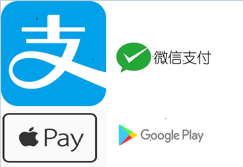

# payment-server 

* [payment-server En Ver...](./README_en.md)

支付逻辑服务器，集成主流第三方支付的项目，包含支付宝、 微信、 Google Play、 Apple Store。

* [支付宝](https://docs.open.alipay.com/api_1/alipay.trade.pay)
* [微信支付](https://pay.weixin.qq.com/wiki/doc/api/app/app.php?chapter=9_1)
* [谷歌支付](https://developer.android.google.cn/google/play/billing/billing_library_overview)
* [苹果支付]()

* [微信APP支付body乱码问题](./doc/payment/wechat/wechat-body.md)

